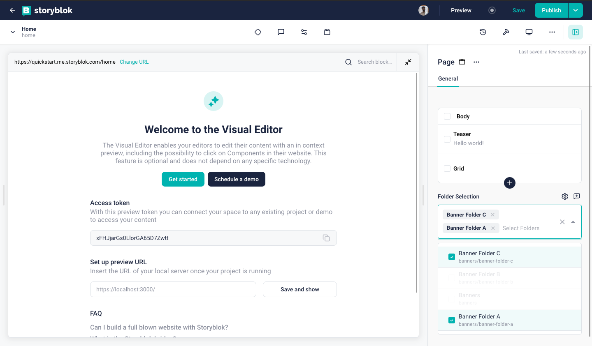

<p style="text-align: center">
  <a href="https://www.storyblok.com/" rel="noopener">
 </a>
</p>

<h1>

Folder Selection Field Plugin
</h1>

A custom field-plugin for Storyblok that allow users to select folders from the space using a dropdown.




## How to use

To add this field plugin to a Storyblok space, you need to

1. Rename the .env.local.example file to .env.local
2. Open the .env.local file and update the `STORYBLOK_PERSONAL_ACCESS_TOKEN` (can be found here: [management api token](https://app.storyblok.com/#/me/account?tab=token))

```bash
STORYBLOK_PERSONAL_ACCESS_TOKEN=[your management api token here]
```

3. From the project's root, run:

```bash
# install dependencies
yarn install

# deploy the plugin using our @storyblok/field-plugin-cli
yarn deploy
```

4. `yarn deploy` will ask you for the plugin's name and also the place this plugin should be added (My Plugins or Partner Portal). Please provide them in order to continue.

5. Once the deployement is done successfully, you can continue its usage following the "Set up" section right below.

Ps: If you are facing some issue performing these steps, you could also check our updated article on how to create and deploy field-plugins here: [Introduction to field-plugin](https://www.storyblok.com/docs/plugins/introduction).

# App Description

With this plugin, you have the ability to select folders as in a dropdown field. It is pretty useful when you have a usecase to select folders. If you want to get folder data in the response and use it for any purpose. For example, creating an automatic navigation using the stories of the selected folder.

## How to set up

In the block library, select a block to edit. Add a new field, set the _Field Type_ to _Plugin_, and set the _Custom
Type_ to `folder-selection` (or the name you provided).

Configure the options:

- `starts_with` (optional): A string to only show the folders whose path starts from the given value.

- `maximum` (optional): An integer to have a maximum number of folders that can be selected.

Example output:

```json
"folder_selection": [
        {
          "id": 417680522,
          "name": "Banner Folder D",
          "slug": "banners/banner-folder-d",
          "uuid": "39ac2716-125d-408f-bbd4-2b0f51ffb116"
        },
        {
          "id": 417678916,
          "name": "Banner Folder B ",
          "slug": "banners/banner-folder-b",
          "uuid": "fa4a10c2-1d8c-4217-9647-a0e441cdf0b8"
        },
        {
          "id": 417678515,
          "name": "Banner Folder A",
          "slug": "banners/banner-folder-a",
          "uuid": "1e429930-5b54-4d2d-bbc9-d91412da7efa"
        }
      ]
```
