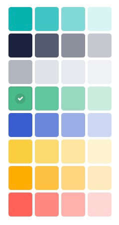

<p style="text-align: center">
  <a href="https://www.storyblok.com/" rel="noopener">
 </a>
</p>

#  storyblok-palette

A custom field-type that allows users to select a color from a palette. 



## How to use

To add this field type to a Storyblok space, you need to

1. Create a new field type in the Storyblok app.
2. Open `src/entries/main.ts` and change the `pluginName` argument from `'storyblok-palette'` to the name of your plugin.
3. Run

```bash
# install dependencies
yarn install

# build the plugin
yarn build
```

4. Copy the contents of `dist/main.js` into the field type editor.
5. Save
6. Publish

### Import plugin into Storyblok

Ensure that the `pluginName` property in `src/config.ts` equals that of your plugin name in the storyblok application. 

Copy the contents of the `dist/export.js` file into the [plugin section](https://app.storyblok.com/#!/me/plugins) of Storyblok.

> **TIP**: On MacOs, run `yarn mac-build`. This will copy the text content of the `export.js` to your clipboard. 

### Define Options

Set up all the available options. See the available options in [options.ts](src/plugin/types/options.ts).

### Usage

The value of a field type of this plugin will adhere to the schema defined in [field-value.ts](src/plugin/types/model.ts).
