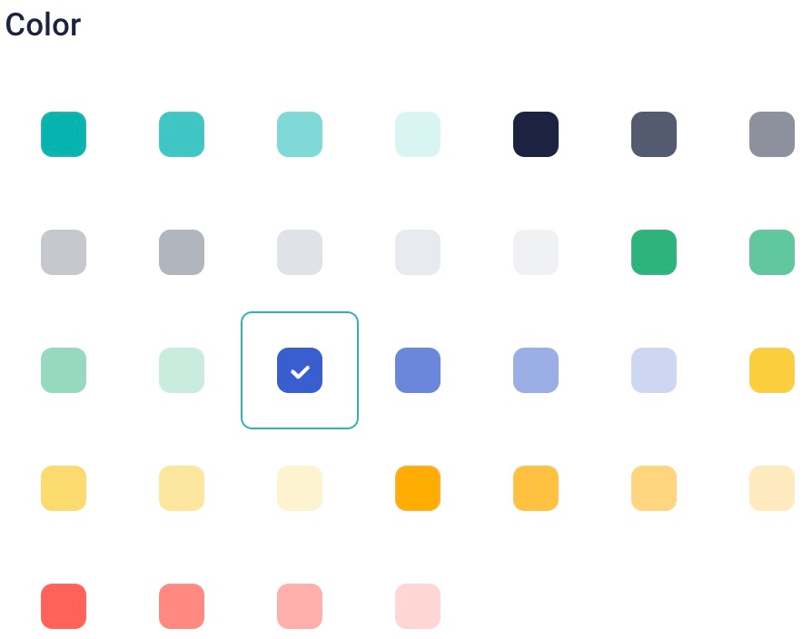
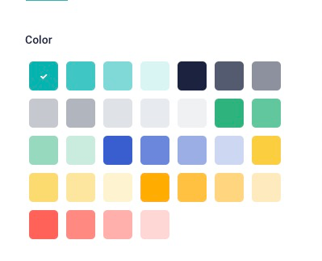
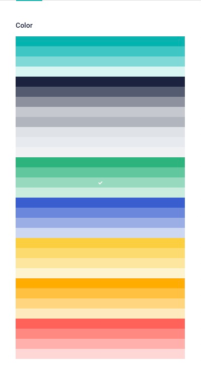

<p style="text-align: center">
  <a href="https://www.storyblok.com/" rel="noopener">
 </a>
</p>

<h1>

Palette Field Type
</h1>

A custom field-type for Storyblok that allow users to select a color from a palette. 


## How to use

To add this field type to a Storyblok space, you need to

1. Create a new field type in the Storyblok app.
2. Open `src/entries/main.ts` and change the `pluginName` argument from `'storyblok-palette'` to the name of your plugin.
3. Run

```bash
# install dependencies
yarn install

# build the plugin
yarn build
```

4. Copy the contents of `dist/main.js` into the field type editor.
5. Save
6. Publish

### Import plugin into Storyblok

Ensure that the `pluginName` property in `src/config.ts` equals that of your plugin name in the storyblok application. 

Copy the contents of the `dist/export.js` file into the [plugin section](https://app.storyblok.com/#!/me/plugins) of Storyblok.

> **TIP**: On MacOs, run `yarn mac-build`. This will copy the text content of the `export.js` to your clipboard. 

### Options

These options are available

* `colors`: A JSON array of hex color strings. For example:
 ```json
[   "#00B3B0", "#40C6C4", "#7FD9D7", "#D9F4F3",   "#1B243F", "#545B6F", "#8D919F", "#C6C8CF",   "#B1B5BE", "#DFE3E8", "#E7EAEE", "#EFF1F3",   "#2DB47D", "#62C79E", "#96D9BE", "#CAECDE",   "#395ECE", "#6B87DB", "#9CAEE6", "#CDD7F3",   "#FBCE41", "#FCDB71", "#FDE6A0", "#FEF3CF",   "#FFAC00", "#FFC140", "#FFD57F", "#FFEABF",   "#FF6159", "#FF8983", "#FFB0AC", "#FFD7D5"]
```
* `defaultValue`: One of the values in `color`, without the quotes.
* `size`: `small`, `medium`, or `large`



