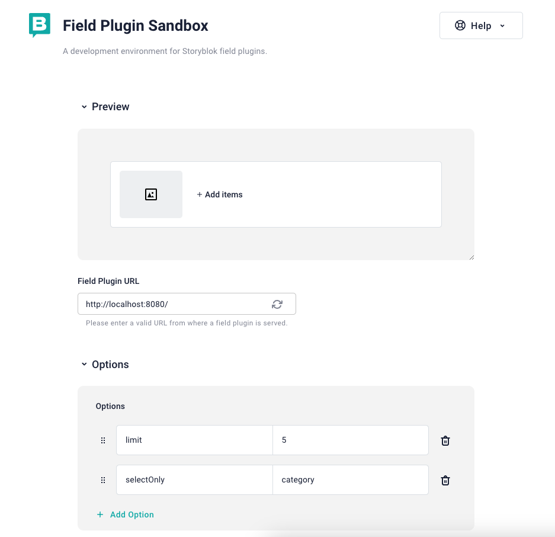
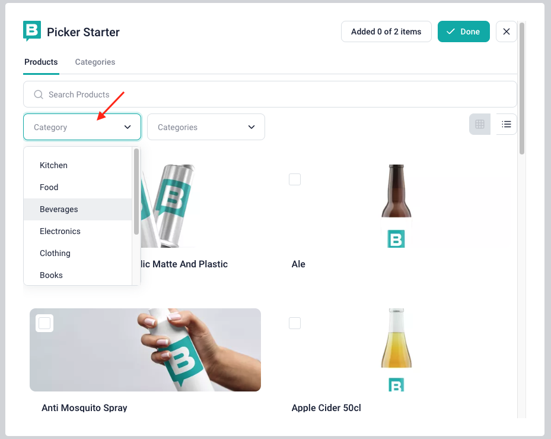

# Picker Starter

A starter project for building e-commerce [field plugins](https://www.storyblok.com/docs/plugins/field-plugins/introduction) and other “picker” field plugins – for example, integrations with digital asset management (DAM) systems.


The primary goal of this starter is to provide developers with a clear blueprint for creating their own `pickers` and for doing so, you'll need to make some small changes to adapt it to match your need.

## How to adapt to your need

To adapt this starter to match your need, you can start by modifying the [platform.ts](./src/plataform.ts) and [options-schema.ts](./src/options-schema.ts) files which are responsible for defining all the services (displayed as tabs) your plugin is going to have and also the expected [options](https://www.storyblok.com/docs/plugins/field-plugins/introduction#options).

### First a little introduction about these files

To make these changes, let's first learn more about how these files work and their responsibilities.

#### platform.ts

This file is responsible for knowing how to `query` the data and handling logic such as sorting and filtering it.

As you can see in the example below, the default `platform` example function returns two services, one is `products` and the other the `categories`.

```js
export const platform: PickerPlatform<OptionsParams> = (options) => ({
  tabs: [
    {
      name: 'product',
      label: 'Products',
      query: queryProducts,
    },
    {
      name: 'category',
      label: 'Categories',
      query: queryCategories,
    },
  ],
})
```

#### options-schema.ts

This file is responsible for handling all [options](https://www.storyblok.com/docs/plugins/field-plugins/introduction#options) your plugin is going to work with and provide validations to it.

In this starter example, we accept two options by default, they are:

- `limit`: how many items this starter can select
- `selectOnly`: which service/tab we want to show. By default, as we have two services (products and categories), you're able to pass `product` or `category` as value.

See below how to test these options using our Sandbox:



### Playing by yourself and making changes

Now you have some base on how the most relevant functions work, let's go deep on this and try to relate it with a whole different plugin.

So, suppose you are working in a `Spotify Song Picker` and you don't want to list products or categories but `songs` and `singers`, you could change the `platform.ts` file to the following:

```js
export const platform: PickerPlatform<OptionsParams> = (options) => ({
  tabs: [
    {
      name: 'songs',
      label: 'Songs',
      query: querySongs, //your function responsible for fetching data (songs in this case) and also sorting and filtering them
      getOptions: getSongsOptions, //optional property responsible for specifying filters to the data (`query` property)
    },
    {
      name: 'singers',
      label: 'Singers',
      query: querySingers,
    },
  ],
})
```

> **Note**
> In the example below, you can see how `getOptions` affects your plugin by adding `select inputs` to act as filters for your retrieved data. Feel free to add your filters.



You can see more about [`query`](./src/core/types.ts#73) and [`getOptions`](./src/core/types.ts#77) here.

Following with the `Spotify Song Picker` example, you can also change the [options-schema.ts](./src/options-schema.ts) file to handle and validate the expected [options](https://www.storyblok.com/docs/plugins/field-plugins/introduction#options) your plugins requires.

For example, adding a new option called `styles`, which would be a list of accepted song styles split by comma and which this plugin is going to accept and work with.

### Understanding the structure in deep

After knowing the basics of how the most relevant files work, you may still need to go deep in your understanding to achieve the result you expect, so below, we describe the roles of which folders one by one.

`📂 src/components`

> All the Vue components reside here. You can add new ones in this folder and also change the existing ones according to your needs.

`📂 src/data`

> Here you're going to find all mocked data used in this example, such as `products list` and `category list`. In a real example, you may fetch the data from an API, so this folder may be removed.

`📂 src/core`

> All the core functions and types are here.

`📂 src/utils`

> Utility functions used across all the project. Feel free to add yours here.

`📄 src/main.ts`

> picker-starter's entrypoint. You usually are not going to change this file.

`📄 src/options-schema.ts`

> In this file you can validate all the expected [options](https://www.storyblok.com/docs/plugins/field-plugins/introduction#options) your field-plugin depends on to work properly.

`📄 src/platform.ts`

> You're going basically to change this file in most of the cases. Here is where all `services/tabs` are defined.

`📄 src/settings.ts`

> Exposes settings used by the picker-starter.

`📄 .env.local.example`

> template containing all the settings your picker-starter requires to work. If you want to modify these settings or to add new ones, you just need to rename `.env.local.example` to `.env.local`.

`📄 field-plugin.config.json`

> picker-starter's [manifest file](https://www.storyblok.com/docs/plugins/field-plugins/storyblok-field-plugin#manifest-file-for-field-plugins).

## Local Development

To start the project locally, from the **repository`s root folder**, run:

```sh
# install all required dependencies
yarn install

# serve the field plugin
yarn workspace picker-starter dev
```

Now open the Sandbox URL printed in your terminal:


You should see this:


## Deploy

Deploy the field plugin with the [CLI](https://www.npmjs.com/package/@storyblok/field-plugin-cli). Issue a [personal access token](https://app.storyblok.com/#/me/account?tab=token), rename `.env.local.example` to `.env.example`, open the file, set the value `STORYBLOK_PERSONAL_ACCESS_TOKEN`, and run

From the **repository's root folder**, run the following command:

```shell
yarn workspace picker-starter deploy
```
