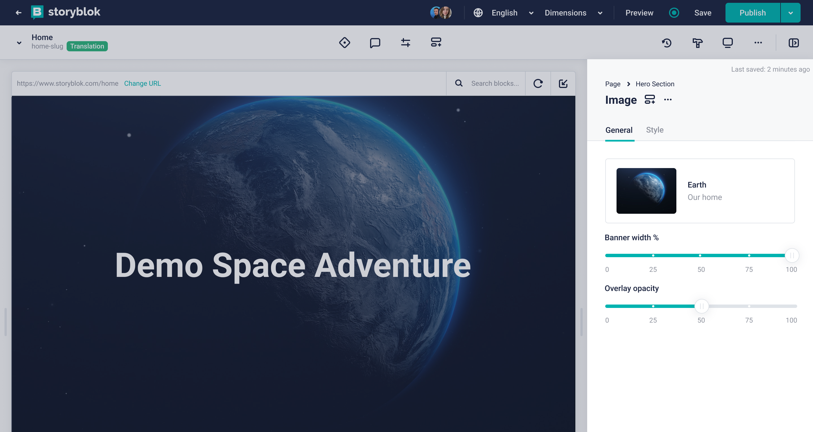
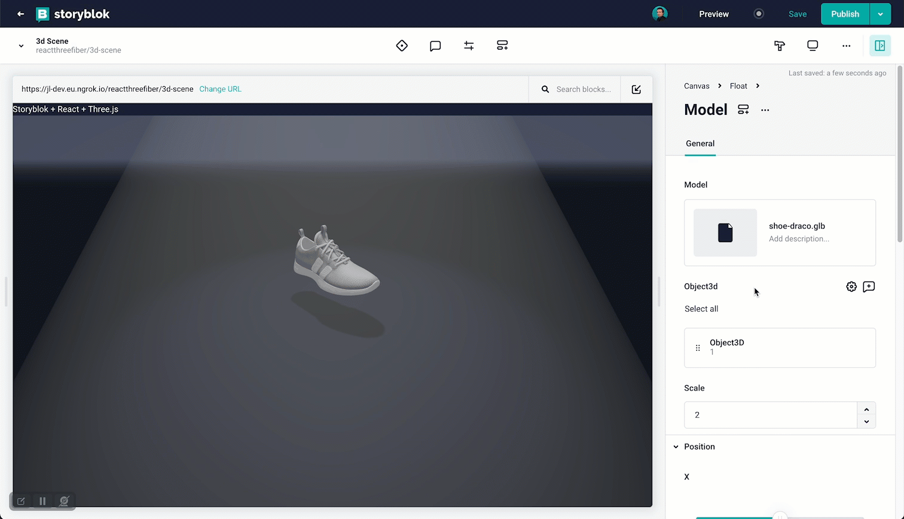

<p style="text-align: center">
  <a href="https://www.storyblok.com/" rel="noopener">
 </a>
</p>

<h1>

Slider Field Plugin
</h1>

A field plugin for Storyblok that allow users to select a number value from a range.





## How to use

To add this field plugin to a Storyblok space, you need to

1. Create a new field plugin in the Storyblok app.
2. Open `src/entries/main.ts` and change the `pluginName` argument from `'storyblok-slider'` to the name of your plugin.
3. Run

```bash
# install dependencies
yarn install

# build the plugin
yarn build
```

4. Copy the contents of `dist/main.js` into the field plugin editor.
5. Save
6. Publish

# App Description

Select a value within a range using the Slider field plugin. Sliders are ideal for setting properties such as opacity, brightness, percentages, and ratios.

## How to set up

In the Block Library, select a block to edit. Add a new field, set the _Field Type_ to _Plugin_, and set the _Custom Type_ to `storyblok-slider`.

Configure the options:

* `minValue`: (optional) The minimum value of the slider's range. Defaults to `0`.
* `maxValue`: (optional) The maximum value of the slider's range. Defaults to `100`.
* `defaultValue`: (optional) The starting position of the slider. This number must be within the range. Defaults to `minValue`.
* `marks`: (optional) A JSON array of numbers. The numbers must be within the range. For each value in this array, a mark will be shown, together with a label for the value. For example, for the range `[-10, 10]`, you can use the the marks `[-5, 0, 5]`.
* `stepSize`: (optional) The minimum distance between points on the scale. To disable it, set the stepSize to `0`. Defaults to `1`.

The options for label formatting affects how the field is rendered, but does not change the output. These options are passed as properties to [Intl.NumberFormat](https://developer.mozilla.org/en-US/docs/Web/JavaScript/Reference/Global_Objects/Intl/NumberFormat/NumberFormat#syntax). If any of the formatting options are invalid, the formatting will be disabled. 

* `minimumSignificantDigits`: (optional) The minimum number of significant digits to use. Possible values are from 1 to 21; the default is 1.
* `maximumSignificantDigits`: (optional) The maximum number of significant digits to use. Possible values are from 1 to 21; the default is 21.
* `style`: (optional) The formatting style to use. If the `style` is `unit`, the `unit` _property_ must be provided. The default is `decimal`.  The following values are allowed:
  * `decimal`
  * `percent`
  * `unit` 
* `unit`: (optional) [core unit identifiers](https://unicode.org/reports/tr35/tr35-general.html#Unit_Elements) to use in unit formatting. Pairs of units can be concatenated with `-per-` to make a compound unit; for example, `kilobit-per-second`. The following values are allowed:
  * `acre`
  * `bit`
  * `byte`
  * `celsius`
  * `centimeter`
  * `day`
  * `degree`
  * `fahrenheit`
  * `fluid-ounce`
  * `foot`
  * `gallon`
  * `gigabit`
  * `gigabyte`
  * `gram`
  * `hectare`
  * `hour`
  * `inch`
  * `kilobit`
  * `kilobyte`
  * `kilogram`
  * `kilometer`
  * `liter`
  * `megabit`
  * `megabyte`
  * `meter`
  * `mile`
  * `mile-scandinavian`
  * `milliliter`
  * `millimeter`
  * `millisecond`
  * `minute`
  * `month`
  * `ounce`
  * `percent`
  * `petabyte`
  * `pound`
  * `second`
  * `stone`
  * `terabit`
  * `terabyte`
  * `week`
  * `yard`
  * `year`

### Examples

Rotation with a default value, discrete steps, marks, and custom formatting:

~~~
minValue: -180
maxValue: 180
stepSize: 5
marks: [-90, 0, 90]
style: unit
unit: degree
~~~


Format a value between 0 and 1 as a percentage:

~~~
minValue: 0
maxValue: 1
stepSize: 0.01
style: percent
~~~


Format with unit and custom significant digits:

~~~
minValue: 0
maxValue: 1000
stepSize: 0
minimumSignificantDigits: 2
maximumSignificantDigits: 2
style: unit
unit: gigabit-per-second
~~~


