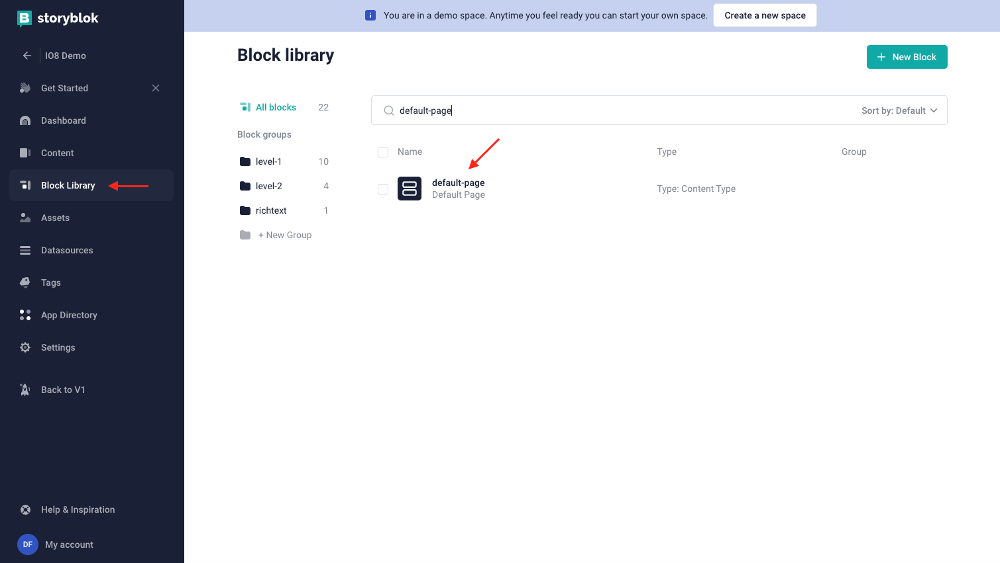
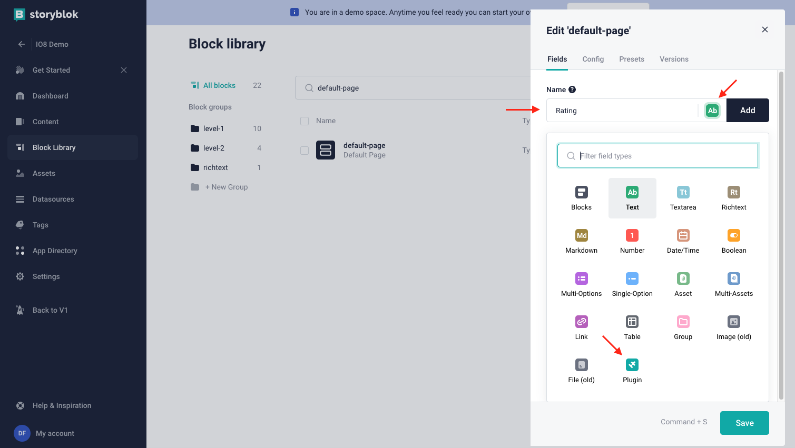
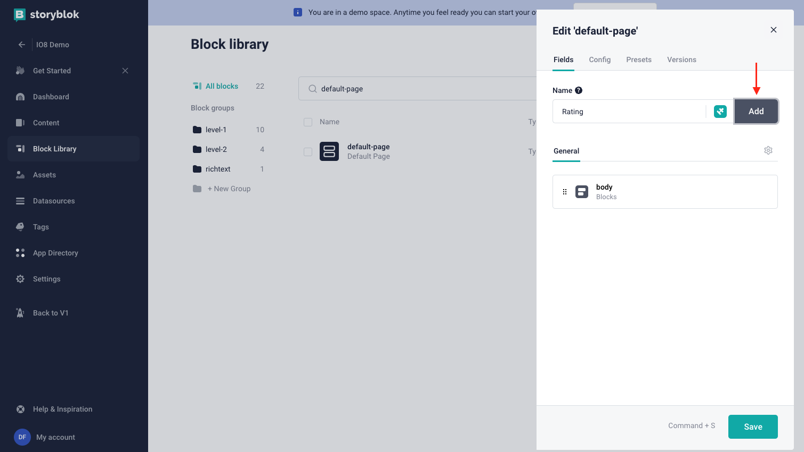
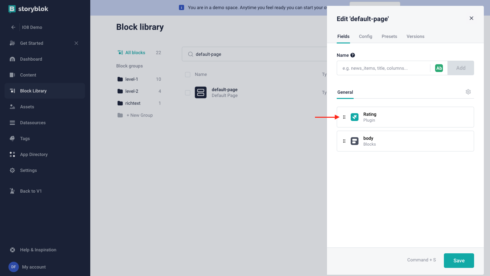
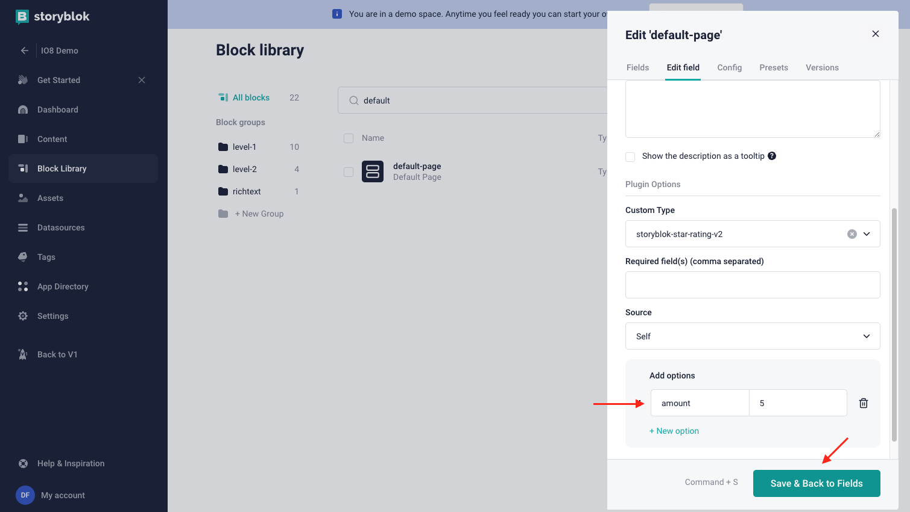

<p style="text-align: center">
  <a href="https://www.storyblok.com/" rel="noopener">
 </a>
</p>

<h1>

Star Rating Field Type
</h1>

A field-type to display a star rating.


## Getting Started

To add this field type to a Storyblok space, you need to

1. Rename the .env.local.example file to .env.local
2. Open the .env.local file and update the `STORYBLOK_PERSONAL_ACCESS_TOKEN` (can be found here: [management api token](https://app.storyblok.com/#/me/account?tab=token))

```bash
STORYBLOK_PERSONAL_ACCESS_TOKEN=[your management api token here]
```

3. From the project's root, run:

```bash
# install dependencies
yarn install

# deploy the plugin using our @storyblok/field-plugin-cli
yarn deploy
```

4. `yarn deploy` will ask you for the plugin's name and also the place this plugin should be added (My Plugins or Partner Portal). Please provide them in order to continue.

5. Once the deploy is done successfully, you can continue its usage following the "Set up" section right below.

Ps: If you are facing some issue performing these steps, you could also check our updated article on how to create and deploy field-plugins here: [Introduction to field-plugin](https://www.storyblok.com/docs/plugins/introduction).

# App Description

Have your audience share their opinion on any topic by giving it a meaningful score.

The star-rating plug-in grants you the ability to add a star-styled rating system to your content, allowing your audience to easily express their opinions and evaluations such as:

- Rating a restaurant
- Rating a movie
- Rating a product/seller

## How to set up

In the block library, select a block to edit:



Add a new field, set the _Field Type_ to _Plugin_:





Open the new created field:



set the _Custom Type_ to `storyblok-star-rating-v2`:


Configure the options and save:



- `amount` (optional): change the amount of stars.
  Default: 5

Example output:

```json
{
  "fieldname": 4.5
}
```
