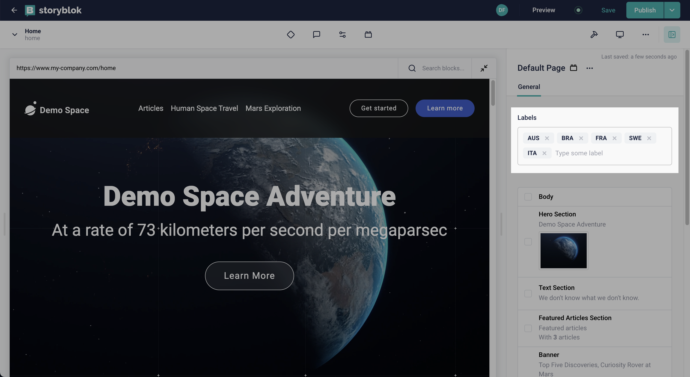
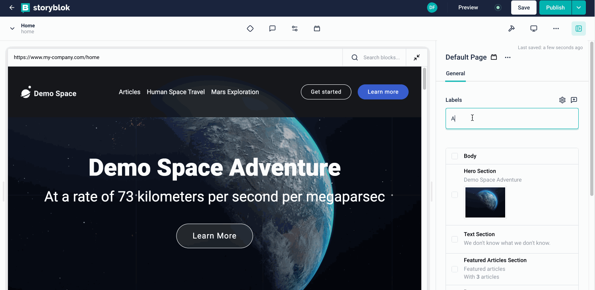

<p style="text-align: center">
  <a href="https://www.storyblok.com/" rel="noopener">
 </a>
</p>

<h1>

Tags Field Type
</h1>

A custom field-type for Storyblok that allow users to select multiple arbitrary options in a free-form way.





## How to use

To add this field type to a Storyblok space, you need to

1. Rename the .env.local.example file to .env.local
2. Open the .env.local file and update the `STORYBLOK_PERSONAL_ACCESS_TOKEN` (can be found here: [management api token](https://app.storyblok.com/#/me/account?tab=token))

```bash
STORYBLOK_PERSONAL_ACCESS_TOKEN=[your management api token here]
```

3. From the project's root, run:

```bash
# install dependencies
yarn install

# deploy the plugin using our @storyblok/field-plugin-cli
yarn deploy
```

4. `yarn deploy` will ask you for the plugin's name and also the place this plugin should be added (My Plugins or Partner Portal). Please provide them in order to continue.

5. Once the deploy is done successfully, you can continue its usage following the "Set up" section right below.

Ps: If you are facing some issue performing these steps, you could also check our updated article on how to create and deploy field-plugins here: [Introduction to field-plugin](https://www.storyblok.com/docs/plugins/introduction).

# App Description

Create lists of strings with a simple interface.

With this plugin, you have the ability to select and showcase a range of distinct labels. This plugin is especially useful for keeping things organized, such as grouping items into categories or assigning labels to them. For instance, if you're sorting different types of products on a website, you can use this plugin to attach tags like "electronics," "clothing," or "books" to each item.

## How to set up

In the block library, select a block to edit. Add a new field, set the _Field Type_ to _Plugin_, and set the _Custom
Type_ to `storyblok-tags`.

Configure the options:

- `initialValue` (optional): A JSON encoded array of string values displayed when the component is loaded. For example:

```json
["AUS", "BRA", "FRA", "SWE", "ITA"]
```

- `placeholder` (optional): the placeholder displayed when the component is not focused.

Example output:

```json
{
  "fieldname": {
    "value": ["AUS", "BRA", "FRA", "SWE", "ITA"],
    "plugin": "storyblok-tags"
  }
}
```
